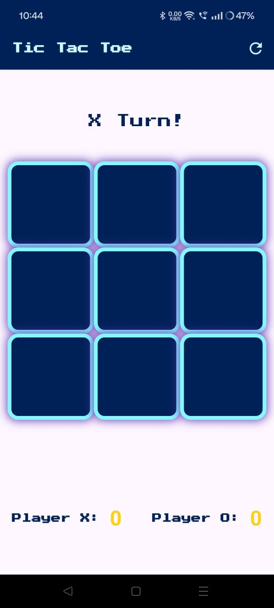
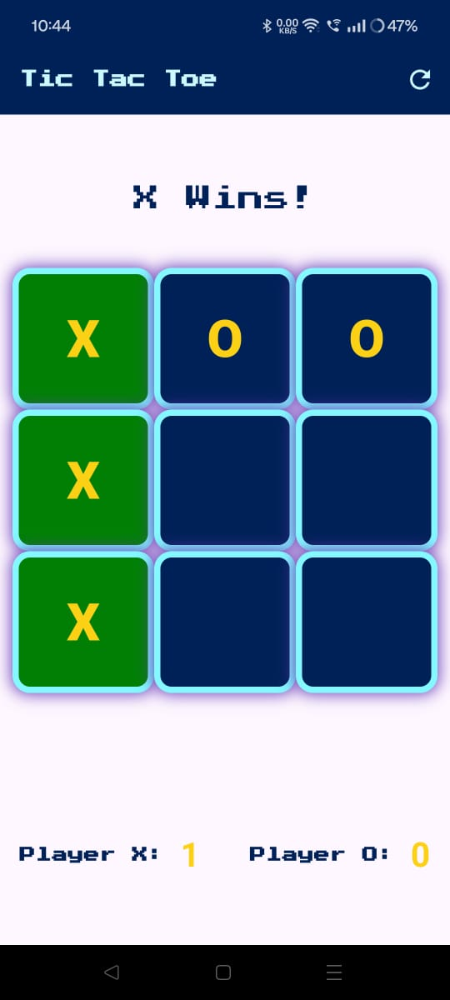

# Tic Tac Toe Game

A fun and interactive Tic Tac Toe game built with Flutter, featuring a sleek user interface and engaging gameplay. This app keeps track of scores, handles invalid moves gracefully, and ensures an enjoyable experience for players of all ages.

## Features

1. Dynamic Gameplay: Alternating turns between Player X and Player O.

2. Score Tracking: Keeps track of wins for each player.

3. Winner Highlighting: Highlights the winning cells for easy identification.

4. Draw Detection: Declares a draw if no valid moves remain.

5. Reset Functionality: Restart the game at any time.

6. Error Handling: Provides feedback for invalid moves with a vibration and a snack bar notification.

## Screenshot
<div align = "center">
  
  
</div>

##  Installation
   * Prerequisits
      1. Flutter SDK installed on your machine.
      2. A code editor like VSCode or Android Studio.
    
   * Clone the repository: 
     ``` bash
     git clone https://github.com/Pinkisingh13/tic-tac-toe.git

   * Navigate to the project directory:
     ```bash
     cd tic-tac-toe
   * Get the dependencies:
     ``` bash
     flutter pub get
   * Run the app
     ``` bash
     flutter run
### Technologies Used
  * Flutter: Framework for building the app.
  * Dart: Programming language for Flutter.
### Contributing
  * Feel free to contribute to this project by opening issues or submitting pull requests. Let's make this app even better together!
### Contact
  * Email: <web.pinkisingh@gmail.com>
  * Linkedin: <https://www.linkedin.com/in/pinkisingh23/>
  * medium: <https://medium.com/@web.pinkisingh>


